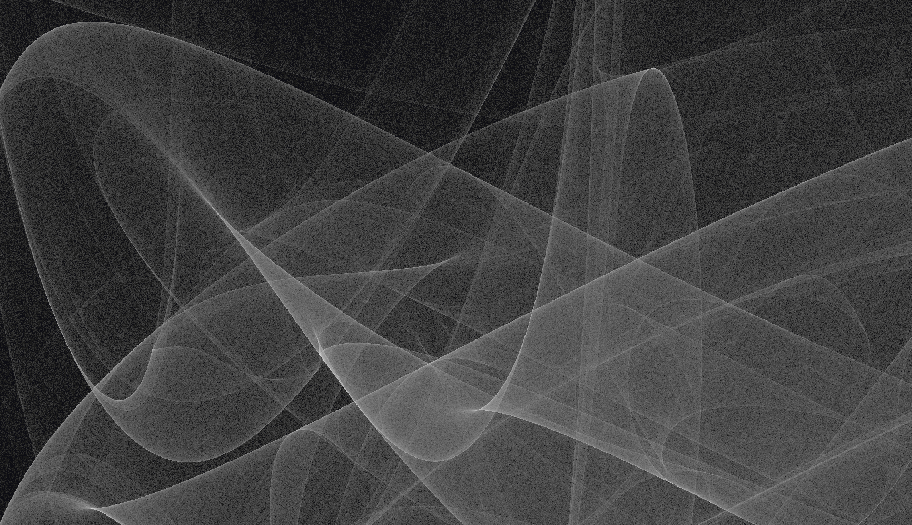

# MathMap Explorer



A web-based exploration tool for visualizing Iterated Function Systems (IFS), fractals, strange attractors, and more. This project provides an interactive canvas to tweak parameters and observe the chaotic yet deterministic beauty of various mathematical systems in real-time.

## Features

This codebase contains real-time renderers for 14 explorations across fractals, attractors, maps, and custom sandboxes:

**Fractals:**
*   **Sierpinski Triangle:** The classic example of an Iterated Function System and the Chaos Game.
*   **Barnsley Fern:** A stunningly realistic fractal fern generated using an affine transformation IFS.
*   **Mandelbrot Set:** The famous escape-time fractal that exhibits infinite complexity.
*   **Newton Fractal:** Root-finding in the complex plane, revealing fractal basin boundaries.
*   **Julia Set:** The companion to the Mandelbrot set — fixed-parameter escape-time fractals with endless variety.
*   **Affine IFS:** A general-purpose affine Iterated Function System renderer for building your own fractals.
*   **Kleinian Group:** Limit sets of Möbius transformations producing intricate fractal dust and curves.
*   **Mandelbrot ↔ Logistic 3D:** A 3D visualization connecting the Mandelbrot set to the logistic map's bifurcation diagram.

**Attractors:**
*   **Peter de Jong Attractor:** A system of trigonometric equations producing elegant, flowing shapes.
*   **Hénon Map:** A discrete-time dynamical system showing chaotic behavior in a butterfly-like shape.

**Maps:**
*   **Logistic Map:** A classic demographic model demonstrating how complex, chaotic behavior arises from simple non-linear equations.
*   **2D Map Bifurcation:** Bifurcation analysis for two-dimensional iterated maps.

**Custom:**
*   **Custom Iterator:** A sandbox for writing your own iterative functions.
*   **L-System:** A string-rewriting system for generating plant-like structures and space-filling curves.

## Getting Started

### Prerequisites

- [Node.js](https://nodejs.org/) (v18 or later recommended)

### Setup

1.  Clone the repository:
    ```bash
    git clone https://github.com/brianbrewington/mathmap_explorer.git
    cd mathmap_explorer
    ```
2.  Install dependencies:
    ```bash
    npm install
    ```

### Running the dev server

```bash
make serve
```

Then open your browser and navigate to `http://localhost:8080`.

You can also use a different port:
```bash
PORT=3000 make serve
```

Alternatively, since this is a static web application built with vanilla JavaScript (ES6 modules), you can serve it with any local web server, e.g.:
```bash
python3 -m http.server
```

### Running tests

```bash
make test
```

To run tests in watch mode:
```bash
make test-watch
```

## Architecture

*   **`index.html`**: The main entry point containing the UI layout (canvas, sidebar, controls panel, info panel).
*   **`css/`**: Styling for the application layout and controls.
*   **`js/app.js`**: The main application controller that handles routing between different explorations and managing the canvas lifecycle.
*   **`js/explorations/`**: Contains the individual classes for each fractal/attractor (e.g., `mandelbrot.js`, `dejong.js`). Each class defines its own parameters, update logic, and rendering method.
*   **`js/math/`**, **`js/renderer/`**, **`js/shaders/`**, **`js/ui/`**, **`js/workers/`**: Supporting modules for complex mathematical operations, WebGL/Canvas rendering, UI building, and potentially off-main-thread computation.

## Educational Resources

If you are new to this field of computational mathematics, here are some excellent resources to help you understand what's happening under the hood:

### 1. Iterated Function Systems (IFS) & The Chaos Game
An Iterated Function System is a method of constructing fractals by repeatedly applying a set of geometric transformations (like rotation, scaling, and translation) to a point or shape.
The "Chaos Game" is a popular algorithmic method for plotting these IFSs by randomly selecting which transformation to apply next—eventually converging to reveal a deterministic fractal.

*   [Wikipedia: Iterated Function System](https://en.wikipedia.org/wiki/Iterated_function_system)
*   [Wikipedia: Chaos game](https://en.wikipedia.org/wiki/Chaos_game)
*   [Numberphile: The Chaos Game (YouTube)](https://www.youtube.com/watch?v=kbKtFN71Lfs)

### 2. Strange Attractors
A strange attractor is a complex, often fractal set of points toward which a chaotic dynamical system tends to evolve over time. Even slightly different starting conditions will diverge rapidly, but they will always remain confined within the beautiful bounds of the attractor.

*   **Peter de Jong Attractor:** Generated by iterative sine and cosine equations.
    *   [Paul Bourke: Peter de Jong Attractors](http://paulbourke.net/fractals/peterdejong/)
*   **Hénon Map:** One of the most studied examples of dynamical systems that exhibit chaotic behavior.
    *   [Wikipedia: Hénon map](https://en.wikipedia.org/wiki/H%C3%A9non_map)
*   **Logistic Map:** A simple polynomial mapping that popularized the concept of period-doubling bifurcations leading to chaos.
    *   [Veritasium: This equation will change how you see the world (YouTube)](https://www.youtube.com/watch?v=ovJcsL7vyrk)

### 3. Escape-Time Fractals
*   **Mandelbrot Set:**
    *   [Wikipedia: Mandelbrot set](https://en.wikipedia.org/wiki/Mandelbrot_set)
    *   [Numberphile: The Mandelbrot Set (YouTube)](https://www.youtube.com/watch?v=NGMRB4O922I)
*   **Newton Fractal:**
    *   [Wikipedia: Newton fractal](https://en.wikipedia.org/wiki/Newton_fractal)
*   **Julia Set:**
    *   [Wikipedia: Julia set](https://en.wikipedia.org/wiki/Julia_set)

### 4. Kleinian Groups & Möbius Transformations
*   [Wikipedia: Kleinian group](https://en.wikipedia.org/wiki/Kleinian_group)

### 5. L-Systems
*   [Wikipedia: L-system](https://en.wikipedia.org/wiki/L-system)
